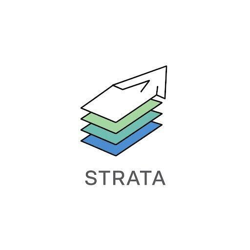



# Strata

Strata offers a unified platform for formalizing language syntax and
semantics, and implementing automated reasoning applications. Strata
provides a family of intermediate representations via _dialects_ that
model specific programming constructs, and is extensible by tool
developers to customize additional features to their needs.

This README will help you get started with using and extending
Strata. Also see the [Architecture](docs/Architecture.md) document
that introduces some terminology and describes Strata's components,
and a [Getting Started](docs/GettingStarted.md) guide that describes
how to create a new dialect and analysis using existing features.

**N.B.: Strata is under active development, and there may be breaking
changes!**

## Prerequisites

1. **Lean4**: Strata is built on Lean4; see the version specified in the
   `lean-toolchain` file.

   Install Lean4 by following the instructions at [lean-lang.org](https://lean-lang.org/).

2. **SMT Solvers**: The verification pipeline and tests require SMT solvers
   (`cvc5` and `z3`). See [Installing dependencies → SMT Solvers](#smt-solvers)
   below.

3. **Python 3.11+**: required for Python-related tests and the `strata`
   Python tooling. See [Installing dependencies → Python](#python) below.

4. **Java JDK (11 or later)**: required for Java code generation tests.
   See [Installing dependencies → Java](#java-for-code-generation-tests) below.

5. **ion-java jar (1.11.11)**: required for the Java/Ion integration test.
   See [Installing dependencies → Java](#java-for-code-generation-tests) below.

### Installing dependencies

#### SMT Solvers

Download static builds (single binary, no library dependencies). The
versions below are known to work; any newer release from the same links
should also be fine.

- cvc5 releases: https://github.com/cvc5/cvc5/releases
- z3 releases: https://github.com/Z3Prover/z3/releases

**Linux x86_64:**

```bash
# cvc5
wget https://github.com/cvc5/cvc5/releases/download/cvc5-1.2.1/cvc5-Linux-x86_64-static.zip
unzip cvc5-Linux-x86_64-static.zip
mkdir -p ~/.local/bin
cp cvc5-Linux-x86_64-static/bin/cvc5 ~/.local/bin/

# z3
wget https://github.com/Z3Prover/z3/releases/download/z3-4.15.2/z3-4.15.2-x64-glibc-2.39.zip
unzip z3-4.15.2-x64-glibc-2.39.zip
cp z3-4.15.2-x64-glibc-2.39/bin/z3 ~/.local/bin/
# Ensure ~/.local/bin is on your PATH (most modern distros include it by default).
```

**macOS (Apple Silicon)** — use the `arm64` variants and prefer the **static**
build to avoid dynamic library issues:

```bash
# cvc5 static for macOS arm64
wget https://github.com/cvc5/cvc5/releases/download/cvc5-1.2.1/cvc5-macOS-arm64-static.zip
unzip cvc5-macOS-arm64-static.zip
cp cvc5-macOS-arm64-static/bin/cvc5 /usr/local/bin/

# z3 for macOS arm64
# z3 for macOS arm64
wget https://github.com/Z3Prover/z3/releases/download/z3-4.15.2/z3-4.15.2-arm64-osx-13.7.6.zip
unzip z3-4.15.2-arm64-osx-13.7.6.zip
sudo cp z3-4.15.2-arm64-osx-13.7.6/bin/z3 /usr/local/bin/
# z3 for macOS arm64
wget https://github.com/Z3Prover/z3/releases/download/z3-4.15.2/z3-4.15.2-arm64-osx-13.7.6.zip
unzip z3-4.15.2-arm64-osx-13.7.6.zip
sudo cp z3-4.15.2-arm64-osx-13.7.6/bin/z3 /usr/local/bin/
# Alternative: install into ~/.local/bin (no sudo), then ensure it's on your PATH.
```

#### Python

Python 3.11 or later is required. Install the `strata` Python package inside a
virtual environment (recommended; avoids PEP 668's `externally-managed-environment`
error on Debian/Ubuntu 23.04+):


#### Java (for code generation tests)

A JDK (11+) providing `javac` must be on your `PATH`. Additionally,
download the ion-java jar used by the Java/Ion integration test:

A JDK (11+) providing `javac` must be on your `PATH`. For running the
Java/Ion integration test, download the ion-java jar:


### Verifying your setup

```bash
cvc5 --version    # should print version info
z3 --version      # should print version info
python3 --version # should be 3.11+
```

## Build

Build and test the code in Lean's standard way:

```bash
lake build && lake test
```

Unit tests are run with `#guard_msgs` commands. No output means the tests passed.

To build executable files only and omit proof checks that might take a long time, use

```bash
lake build strata:exe strata StrataToCBMC StrataCoreToGoto
```

### Running specific test subsets

Two kinds of tests coexist in this repo:

- **Elaboration-time tests** (`#guard_msgs`) live under `StrataTest/` and run as
  part of `lake build`. No output means they passed.
- **Uncached extra tests** live under `StrataTestExtra/` and run via `lake test`.
  These accept prefix filters:


## Running Analyses on Existing Strata Programs

Strata programs use the `.st` file extension, preceded by the dialect name,
preceded by a second `.` e.g., `SimpleProc.core.st` or
`LoopSimple.csimp.st`. Note the current `strata verify` command
relies on this file extension convention to know what dialect it's
parsing (since the Strata IR allows a program to open multiple
dialects).

Here is an example invocation that runs Strata's deductive verifier.

```bash
lake exe strata verify Examples/SimpleProc.core.st
```

This will:
1. Parse, type-check, and generate verification conditions (VCs) via
   symbolic evaluation.
2. Use an SMT solver to discharge the VCs.
3. Report the results.

Currently, each VC that is not proved by symbolic simulation alone is
printed out in Strata's internal format (more accurately, in the
internal format of the dialects used to implement the language under
analysis). These VCs are then encoded into SMT, and counterexamples,
if any, report models for the variables present in the problem.

See [Verification Modes](docs/VerificationModes.md) for details on
the `--check-mode` flag and the deductive and bug-finding verification
modes.

## Troubleshooter

### When running unit tests: "error: no such file or directory (error code: 2)"

This is likely due to `cvc5` or `z3` not being in the PATH environment variable. Add them and try again.

## License

The contents of this repository are licensed under the terms of either
the Apache-2.0 or MIT license, at your choice. See
[LICENSE-APACHE](LICENSE-APACHE) and [LICENSE-MIT](LICENSE-MIT) for
details of the two licenses.

