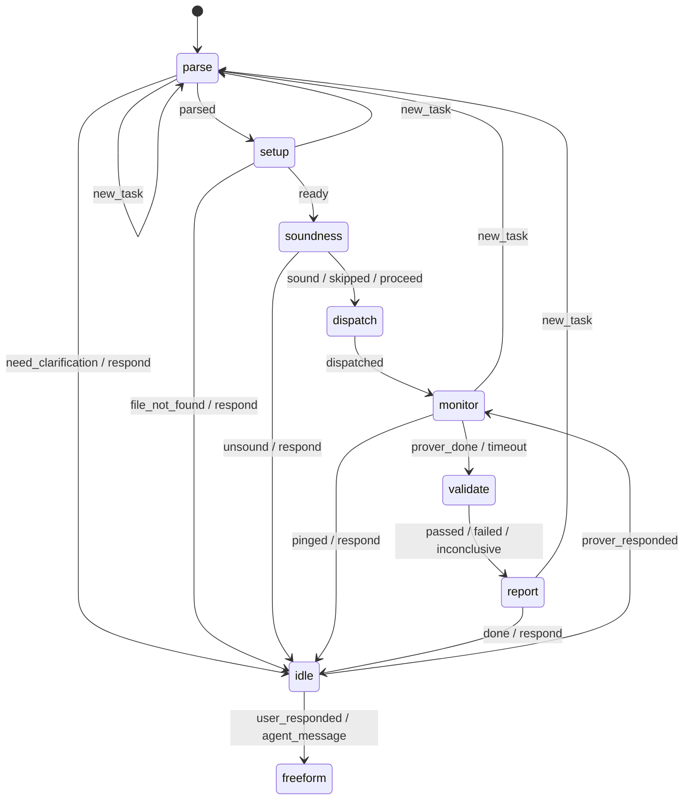

## Task Manager Agent

```mermaid
stateDiagram-v2
    [*] --> parse
    parse --> setup : parsed
    parse --> idle : need_clarification / respond
    parse --> parse : new_task
    idle --> freeform : user_responded / agent_message
    idle --> monitor : prover_responded
    setup --> soundness : ready
    setup --> idle : file_not_found / respond
    setup --> parse : new_task
    soundness --> dispatch : sound / skipped / proceed
    soundness --> idle : unsound / respond
    dispatch --> monitor : dispatched
    monitor --> validate : prover_done / timeout
    monitor --> idle : pinged / respond
    monitor --> parse : new_task
    validate --> report : passed / failed / inconclusive
    report --> idle : done / respond
    report --> parse : new_task
```